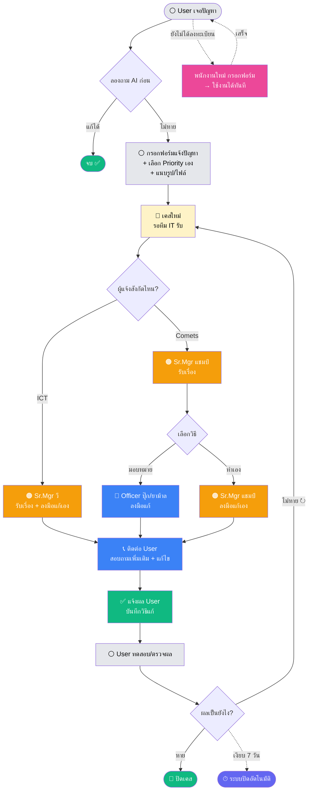

# IT Ticket — Business Workflow

> **URL:** https://project-code-wine.vercel.app
> กระบวนการแจ้งปัญหา IT ตั้งแต่ User เจอปัญหา → ปิดเคส

---

## ผู้เกี่ยวข้อง

| Role | ชื่อ | บทบาท |
|------|-----|-------|
| 🟣 **Manager** | คุณเบิร์ด | ดูภาพรวมทุกอย่าง |
| 🟠 **Senior Mgr ICT** | คุณวี | ดูแลงาน ICT (ลงมือแก้เอง) |
| 🟠 **Senior Mgr Comets** | คุณแชมป์ | ดูแลงาน Comets (มอบหมาย/แก้เอง) |
| 🔵 **IT Officer** | คุณปุ๊ก, คุณยาม้าล | แก้ปัญหาฝั่ง Comets |
| ⚪ **User** | พนักงานทั่วไป | แจ้งปัญหา, กรอก Priority, ยืนยันปิดงาน |

---

## Flow การทำงานทั้งหมด

---

## ระดับความเร่งด่วน (SLA)

*นับเฉพาะเวลาทำงาน จ–ศ 08:00–17:00 | User เลือกเอง*

| Priority | ตัวอย่าง | ต้องเสร็จภายใน |
|:--------:|---------|:---------------:|
| 🔴 **ด่วนมาก** | งานหยุด / ผู้บริหาร / ปิดงบ | **2 ชม.** |
| 🟠 **สำคัญ** | ต้องใช้วันนี้ | **4 ชม.** |
| 🟡 **ปกติ** | รบกวนแต่มีทางแก้ชั่วคราว | **8 ชม.** |
| ⚪ **ไม่เร่ง** | ขอสิทธิ์ / ติดตั้งโปรแกรม | **24 ชม.** |

> ⏱ **เกิน SLA** → ระบบแค่แจ้งเตือน ไม่มี escalate / ไม่เปลี่ยนคนรับงาน

---

## ขอบเขตความรับผิดชอบ

| กิจกรรม | ⚪ User | 🔵 Officer | 🟠 Sr.Mgr | 🟣 Manager |
|---------|:----:|:----:|:----:|:----:|
| แจ้งปัญหา + กรอก Priority | ✅ | ✅ | ✅ | ✅ |
| รับงานมาแก้ | — | ✅ | ✅ | — |
| มอบหมายให้ Officer | — | — | ✅ *(Comets)* | — |
| บันทึกวิธีแก้ | — | ✅ | ✅ | — |
| ยืนยันปิดงาน | ✅ | — | — | — |
| ดูภาพรวม | — | *(งานตัวเอง)* | ตามสังกัด | ทุกอย่าง |

---

## เงื่อนไขสำคัญ

- **ICT ไม่มี Officer** → Sr.Mgr วี แก้เอง
- **Comets** → Sr.Mgr แชมป์ เลือกได้ว่าจะมอบให้ Officer หรือแก้เอง
- **Priority** → User กรอกเอง ตอนเปิด Ticket
- **ลงทะเบียน User ใหม่** → พนักงานกรอกฟอร์มเอง → **ใช้งานได้ทันที** (ไม่ต้องรออนุมัติ)
- **User เงียบ 7 วัน** → ถือว่าแก้ได้แล้ว ปิดเคสอัตโนมัติ
- **เกิน SLA** → ระบบแจ้งเตือนให้รับรู้เท่านั้น
